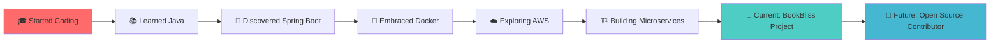

<div align="center">
  
</div>

<div align="center">
  <h2>👋 Welcome to my GitHub Universe! </h2>
</div>

<div align="center">
  
</div>

<div align="center">
  
  
</div>

---

## 🚀 About Me

<div align="center">
  
</div>

<table>
<tr>
<td width="50%">

### 👨‍💻 Developer Profile
```yaml
Name: Manoj Pandi
Role: Full Stack Developer
Location: India 🇮🇳
Experience: Building scalable applications
Motto: "Code with purpose, debug with patience"

Current_Status:
  - 🔭 Working_On: BookBliss Library System
  - 🌱 Learning: Microservices & System Design  
  - 🎯 Goal: Open Source Contributions
  - 💼 Seeking: Backend Engineering Opportunities

Contact:
  Email: manojpandi@gmail.com
  Availability: Open for collaboration
```

</td>
<td width="50%">

### 🛠️ Tech Arsenal
```python
class TechStack:
    def __init__(self):
        self.backend = ["Java ☕", "Spring Boot 🚀"]
        self.frontend = ["React ⚛️", "JavaScript 💛"]
        self.databases = ["MySQL 🐬", "PostgreSQL 🐘", 
                         "MongoDB 🍃", "Redis ⚡"]
        self.devops = ["Docker 🐳", "AWS ☁️"]
        self.tools = ["Git 📂", "Postman 📮", "Grafana 📊"]
    
    def get_current_focus(self):
        return "Microservices Architecture 🏗️"
    
    def favorite_debugging_method(self):
        return "console.log() // Don't judge me! 😅"

developer = TechStack()
```

</td>
</tr>
</table>

<div align="center">
  
</div>

### 🎮 Quick Stats & Fun Facts

<div align="center">

| 💻 **Coding Journey** | 🚀 **Current Mission** | 🎯 **Next Level** |
|:---:|:---:|:---:|
| Building BookBliss 📚 | Mastering Microservices 🔧 | Contributing to OSS 🌟 |
| Spring Boot Expert ⚡ | System Design Student 📖 | Cloud Native Explorer ☁️ |

</div>

<details>
<summary>🔍 <b>Click to see more about my journey!</b></summary>

<br>



**🌟 What drives me:**
- 💡 Solving complex problems with elegant solutions
- 🔧 Building systems that scale and perform
- 🌍 Creating software that makes a difference
- 📚 Continuous learning and sharing knowledge

**⚡ Fun Facts:**
- I can debug for hours without getting frustrated 🕐
- My code comments are probably longer than my code 📝
- I believe good architecture is like good music - you feel it! 🎵
- Coffee is not just a beverage, it's a programming language ☕

</details>

---

## 🏆 GitHub Trophies
<div align="center">
  
</div>

---

## 🛠️ Tech Stack

### **Languages**
<div align="center">
  
</div>

### **Frameworks & Libraries**
<div align="center">
  
</div>

### **Databases**
<div align="center">
  
</div>

### **DevOps & Tools**
<div align="center">
  
</div>

---

## 📊 GitHub Analytics

<div align="center">
  
  
</div>

<div align="center">
  
</div>

---

## 🔥 Contribution Graph
<div align="center">
  
</div>

---

## 🎯 Current Focus

<div align="center">
  
  
  
</div>

---

## 📈 Weekly Development Breakdown
```text
Java           8 hrs 25 mins   ███████████████░░░░░░   65.2%
Spring Boot    3 hrs 15 mins   ██████░░░░░░░░░░░░░░░░   25.1%
JavaScript     1 hr 12 mins    ██░░░░░░░░░░░░░░░░░░░░    9.3%
Docker         15 mins         ░░░░░░░░░░░░░░░░░░░░░░    0.4%
```

---

## 🌐 Connect With Me

<div align="center">
  <a href="https://www.linkedin.com/in/manojpandi2603" target="_blank">
    
  </a>
  <a href="mailto:manojpandi@gmail.com" target="_blank">
    
  </a>
  <a href="https://github.com/ManojPandi26" target="_blank">
    
  </a>
</div>

---

## 💻 Featured Projects

<div align="center">
  <a href="https://github.com/ManojPandi26/BookBliss_SB">
    
  </a>
</div>

---

## 🎵 Random Dev Quote
<div align="center">
  
</div>

---

<div align="center">
  
</div>

<div align="center">
  <h3>⭐ From <a href="https://github.com/ManojPandi26">Manoj Pandi</a> | Made with ❤️ and lots of ☕</h3>
</div>
